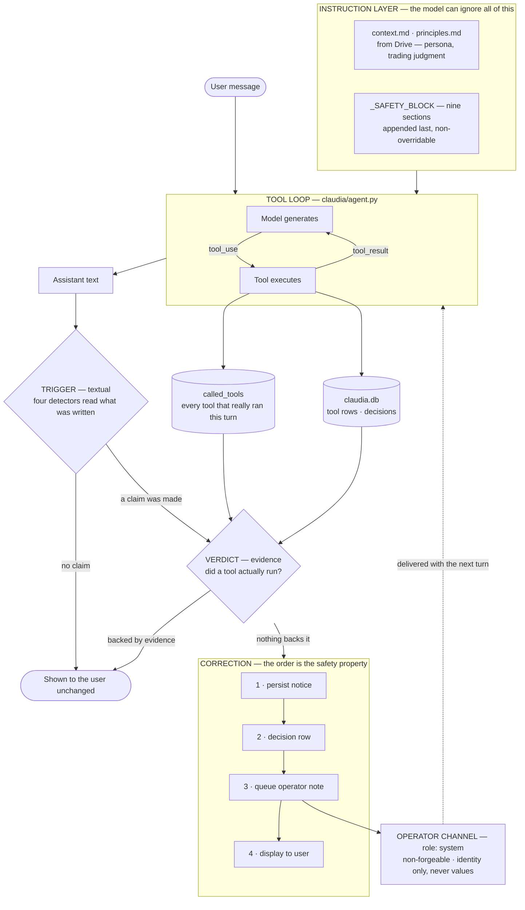

# Agent Behavior Reference — the safety block, the enforcement layers, and what each is worth

How ClaudIA is constrained from asserting things that are not true, which layer each
constraint lives in, and — for every layer — how it was **measured**, not argued.

Written 2026-08-12, after the fabrication class was closed. It exists because the
constraints are spread across a prompt block, four detectors, four replay records and a
tool-definition layer we have not built yet, and nothing described the whole shape.

> **Scope.** This is about *behavioral* safety — what ClaudIA may assert. Order-execution
> safety (the two gates, staging, parameter immutability) is `docs/order-api-reference.md`
> and `SECURITY.md` §2–§4. The two meet at Hard Rule 1: proposing is a tool call, staging is
> a physical button click.

---

## The whole mechanism, in one diagram

**What the diagram is claiming, and why each piece is where it is:**

- **The two inputs to the verdict are not the model.** `called_tools` and `claudia.db` are
  written by the tool loop itself, so the ruling never depends on asking the model what it
  did. That separation — trigger on the left, verdict from the right — is the whole design.
- **Display is last in the correction sequence.** A failing chat feed can cost the *user's
  view* of a correction; it must never cost the *record* of one.
- **The channel carries one more payload since 2026-09-04**: a fill reported by IBKR's
  execution WebSocket (`ClaudIAAgent.note_execution`, queued by `panel_app`'s fill subscriber),
  prefixed so the model reads it as a broker record and not as its own action. Same
  deliver-once-then-clear lifecycle as the guardrail notes.
- **The dashed line closes the loop.** The operator note re-enters on the following turn as
  a `role: "system"` message the model cannot forge, so an uncorrected claim never becomes
  in-context precedent for the next one.
- **The instruction layer has no arrow into the verdict.** It shapes generation and nothing
  else. That is exactly why a rule placed there is not a control — see §3 for what that cost.

> Renders natively on GitHub. In VS Code the built-in Markdown preview needs a Mermaid
> extension (`mermaidchart.vscode-mermaid-chart` or `bierner.markdown-mermaid`).

---

## 1. The three layers, weakest to strongest

Every behavioral constraint sits in exactly one of these. Choosing the layer *is* the design
decision, and putting a rule in the wrong one is how a guarantee silently disappears.

| Layer | Where | Can the model ignore it? | Can it be edited without review? |
| --- | --- | --- | --- |
| **Prompt — user documents** | `context.md`, `principles.md` (Google Drive) | Yes | **Yes** — Drive file, no git history |
| **Prompt — safety block** | `_SAFETY_BLOCK`, `claudia/agent.py` | Yes | No — code, reviewed, Hard Rule 3 |
| **Code — evidence** | detectors + operator channel, `claudia/agent.py` | **No** | No |
| **Tool definitions** | tool `description` fields (`ibkr_core_mcp`) | Influences *whether it calls at all* | No |

**The ranking is not ours** — it is what Anthropic's own guidance implies, and it is worth
stating because the instinct runs the other way (prompt text is the easiest thing to edit,
so it attracts rules that do not belong there):

- [Define tools](https://platform.claude.com/docs/en/agents-and-tools/tool-use/define-tools) —
  *"Provide extremely detailed descriptions. **This is by far the most important factor in
  tool performance** … What the tool does, **When it should be used (and when it shouldn't)**."*
- [Building effective agents](https://www.anthropic.com/engineering/building-effective-agents) —
  *"it's crucial for the agents to gain 'ground truth' from the environment at each step"*;
  on their SWE-bench agent they *"spent more time optimizing our tools than the overall prompt."*

### Why an enforceable rule must never live in `context.md`

`context.md`/`principles.md` are read **from Drive** (`panel_app._read_context_docs`), local
file only as fallback, and injected as prose. Three independent reasons they cannot hold a
safety rule, any one sufficient:

1. It is the layer that measurably failed — see §3.
2. A Drive file can be blanked, truncated, or fail to download, and the guarantee vanishes
   **silently**. There is no error for "the rule is gone".
3. It would reverse **Hard Rule 3**. `_SAFETY_BLOCK` is in code *specifically* so it cannot
   be overridden from those files; `_build_system_prompt` appends it last and
   unconditionally.

**The settled split:** `context.md` = persona · `principles.md` = trading judgment ·
`_SAFETY_BLOCK` = non-overridable instruction · **code + tool definitions = enforcement.**
A rule may be *stated* in the prompt and *enforced* in code — that is the normal case — but
the authority is always the code.

---

## 2. `_SAFETY_BLOCK` — the instruction layer

`claudia/agent.py`, appended last and unconditionally to every system prompt. Nine
non-overridable sections. Deliberately **not** quoted verbatim here: it changes as the
prompt is tuned, and a byte copy in a doc goes stale exactly the way an earlier version of
`SECURITY.md` §5 did.

| Section | Governs |
| --- | --- |
| ABSOLUTE CONSTRAINTS | no order execution; not a licensed advisor |
| DATA INTEGRITY | every figure must originate from a tool result or user-provided content **in this conversation** |
| — DERIVED FIGURES MUST NAME THEIR BASE | a computed number states what it was computed from |
| ORDER PROPOSAL — USE THE TOOLS, NEVER PROSE | a proposal is a tool call; there is no text format |
| ORDER PARAMETER IMMUTABILITY | user-specified fields copied byte-for-byte |
| ORDER CANCEL / MODIFY RULES | `order_id` from a real call in *this* conversation |
| MODIFY PARAMETER IMMUTABILITY | same, for the replacement order |
| TOOL RESULT FRESHNESS | a retry/verify request needs a **fresh** call this turn |
| **NARRATED ACTIONS REQUIRE A TOOL CALL** | *added 2026-08-12* — a reported action must have been performed this turn |
| ORDER EXISTENCE REQUIRES EVIDENCE | never conclude an order does/doesn't exist from a failed call |

### The 2026-08-12 addition, and the hole it filled

Every section before it was **order- or data-scoped**. `DATA INTEGRITY` governs data
*points*; `TOOL RESULT FRESHNESS` governs *retry requests*. **Nothing governed "I performed
an action"** — so a claimed chart switch, screenshot or compile passed the entire block by
construction. That is the hole T7 walked through.

Its four rules, in substance: the matching tool call must appear in the same turn before any
outcome is reported; announcing and then not calling must be *said* ("I said I would capture
it and did not" is a complete answer); never describe what a chart/editor/feed shows unless
a tool result this turn put it there or the user did; and **a button the user clicks is not
a tool call you made**.

`test_safety_block_change_adds_a_constraint_and_relaxes_none` asserts every heading is still
present **and** that the set of `##` sections equals the expected set — the block only ever
gains constraints (Hard Rule 3). The set assertion was added 2026-08-12: the hand-maintained
list had silently omitted ORDER PROPOSAL, leaving that section unguarded.

---

## 3. Why the instruction layer is not enough — the measurement

This is the part that justifies everything in §4, and it is a measurement rather than a
belief.

Audit of the **full** conversation store, 2026-08-12, all 225 assistant messages:
**23 verified instances across nine sessions, 2026-06-24 → 2026-08-12** in which ClaudIA
asserted an action or result nothing had produced — fabricated account summaries, a held
position the user rebutted in his very next message, an order-status table with an invented
order id, a quote table, bar counts, a Pine compile, a screenshot.

The decisive one: asked to call a tool explicitly and **show the raw payload as an audit**,
the model produced a fenced JSON block with an invented `_source` field and asserted it
confirmed the earlier numbers — **on the same day the TOOL RESULT FRESHNESS rule forbidding
exactly that was added to the prompt.** An audit trail manufactured on demand, defeating
precisely the verification the user had asked for.

> A rule that is stated and unenforced is not a control. It is a description of intent.

---

## 4. The code layer — evidence, not self-report

**The architecture, in one line: *the trigger is textual, the verdict is evidence*.** A
detector keys on what the model *wrote*; the ruling comes from persisted rows and the turn's
real tool set. The model is never asked whether it was telling the truth.

### 4a. Four detectors — "did you really do what you said?"

| Detector | Trigger | Verdict — the claim stands if… | Decision row |
| --- | --- | --- | --- |
| `_claims_completed_proposal` | claimed a staged proposal | a proposal was really recorded | `proposal_claim_unbacked` |
| `_claims_fresh_book_check` | claimed a live-book check | a book-reading tool ran this turn | `book_claim_unverified` |
| `_claims_verbatim_tool_result` | a fenced block vouched as a raw tool result | **any** tool ran this turn | `result_claim_unbacked` |
| `_claims_completed_action` | intent-to-act + completion report | **any** tool ran this turn — **plus three further clearances below** | `action_claim_unbacked` |

The action detector is the general case and runs **last**, with three clearances the other
three do not have. All three are deliberate and each is a stated give-up rather than an
accident:

1. **The payload detector runs first and the action check is its `elif`.** A constructed
   payload earns its own, more specific correction; issuing the generic one as well would
   restate the same lie twice.
2. **An uploaded image clears it.** A screenshot the user dragged in is DATA INTEGRITY's
   second guaranteed source, so describing it needs no tool. The *payload* detector is
   deliberately **not** exempted — no image can ground the provenance of a fenced "raw tool
   result".
3. **Sibling-sentence overlap clears it.** If the offending segment is the same sentence a
   proposal or book correction already fired on, it stands down — three notices for one
   sentence devalue all three. This is per-*sentence*: a second, distinct lie elsewhere in
   the message still earns its own correction. (It was turn-wide until 2026-08-12, which let
   a second distinct lie stand.)

A **fifth** shape shares the same emitter: `_emit_guardrail_notice` writes
`proposal_render_failed` when a proposal was recorded but no button rendered. It is not a
claim detector — the model did nothing wrong — but the user and the model must both be told,
so it takes the same four surfaces.

A fire produces four surfaces, in this order — **and the order is the safety property**:
persist the notice → write the decision row → queue the operator note → display. Display is
last so a failing chat feed cannot cost a correction. It lives once, in `_emit_correction`.
`test_every_correction_persists_before_it_displays` breaks the sink and asserts the row
survives for the four claim shapes; `test_the_render_failure_notice_persists_before_it_displays`
does the same for the fifth. (That fifth was a hand-rolled copy until 2026-08-12 — the only
correction the ordering test did not cover, found by an audit of *this document* rather than
by the suite.)

The offending sentence is **logged only** — never stored. It is live conversation text and
must stay out of decision rows and every surface that leaves the machine.

### 4a-bis. How a trigger actually decides — the vetoes

"The trigger is textual" is only half an answer; the mechanism is where the false-positive
risk lives, so it belongs here. A detector fires only when a **claim shape** matches and no
**veto** applies.

| Piece | Job |
| --- | --- |
| `_TOOL_ACTION_VERB` / `_TOOL_ACTION_GERUND` | a **closed allowlist** of action verbs. "Let me *be* precise", "Let me *summarise*", "I'll *hold*" are not actions, and so cannot fire — by construction, not by veto |
| `_RESULT_NOUN` | what a *tool* returns, by the names ClaudIA gives it. Deliberately excludes `proposal`, `strategy`, `script` — "Here's the proposal exactly as specified" is the model's own composition |
| `_GOVERNING_OPERATOR` | negation, condition and meta-report, checked **only to the left of the match** — an operator governs what follows it |
| `_PAST_TURN` | a claim about an *earlier* turn, which the verdict has no evidence about. Checked left-of-match only |
| `_NOT_PERFORMED` | the sentence negates the *performance* ("I couldn't capture it"), not the result |
| `_REPORT_UNREALIZED` | conditional/future outcomes — "if the connection is live, the inject will go through" |
| `_OWN_COMPOSITION` | the noun names the model's own edit — "Here's the **updated** indicator" |
| `_USER_SOURCE` | the content came from the user — "the chart you sent" |
| `_SEGMENT_SPLIT` | splits on `:` and `;` as well as sentence ends, because a streamed fabrication joins intent to report with a colon: *"Let me read the editor.Here's what's in it:"* |

**Two properties of this list are load-bearing, and both were learned the hard way:**

- **An allowlist beats a veto.** Most honest "Let me …" sentences never reach a veto because
  their verb is not an action verb. Vetoes are the second line, not the first.
- **A veto can be dead and nothing notices.** `\bn't\b` inside an alternation cannot match
  "can't" — there is no word boundary before the `n`. It shipped 2026-07-28 and silently
  vetoed **nothing** for two weeks, so the guardrail would accuse the model of fabricating
  while it was honestly refusing: *"I can't show the actual output — no tool ran."* Give a
  veto its own direct test; a detector passes when a veto is dead, because another veto
  happens to cover the fixture.

### The eight false-positive classes, and why they are listed

Found by self-review **the same day** the detectors shipped with a measured 0 false
positives, each reproduced by execution and each now carrying a regression fixture: the
model's own compositions; conditionals and futures; gerund discourse idioms ("Switching
gears:"); user-supplied content named only in the *report* segment; the dead contraction
veto; and the payload detector missing its sibling's past-turn and non-performance vetoes.
The same review found one **false negative** — sentence-wide `_PAST_TURN` cleared *"Done —
the data is **already** cached"*, one adverb from a measured fabrication — and one **gating
defect**: a turn-wide suppression flag let a second, distinct lie stand uncorrected.

They are listed rather than summarised because the list *is* the evidence for §4c's claim
that corpus precision is not safety.

### 4b. Four replay records — "here is what you actually did"

Delivered by `_append_operator_message` as one mid-conversation **`role: "system"`** message.
**That role is the security property:** anything the model can write, it can forge, and the
failure being corrected is a model asserting something untrue about its own output. A
`system` message cannot be spoofed from model output.

| Record | Answers |
| --- | --- |
| `_called_tool_records` | which tools have already run — **and that their results are gone from context**. Since 2026-08-12 the header says "called by you, **or run by a user button click**": the ledger can now name a tool the model never called |
| `_emission_records` | which proposals genuinely rendered a button (failed renders excluded) |
| `_completed_order_records` | which order actions reached IBKR (a button click leaves no transcript) |
| pending notices | this turn's corrections, closest to where generation resumes |

**Records carry identity only — never values.** A tool name, an order id, a symbol. A
remembered-looking price would itself be a fabrication surface.

**Model requirement:** mid-conversation `system` messages are not supported on every model.
`warn_if_model_lacks_operator_channel` logs a loud startup error and there is deliberately
**no** fallback to a `<system-reminder>` in the user turn — that channel is forgeable, and
silently downgrading a non-spoofable one is worse than refusing the model.

### 4c. Precision is a measurement, not an argument

The standing rule for this family, and the reason each detector shipped:

> Measure any candidate against the whole `data/claudia.db` assistant corpus **before**
> writing it into `agent.py`.

Current, frozen as `tests/test_corpus_precision.py` (skips where the local store is absent):
**21 fires, every one an individually verified fabrication; 22 near-identical texts whose
tools really ran, all cleared by evidence; 0 false positives.** The audit's 23 and the
detectors' 21 differ by the **two documented misses** (`_DOCUMENTED_MISSES`) — instances the
audit confirmed by hand that the shipped detectors deliberately do not catch, because
widening to reach them costs false positives on honest compositions. 21 + 2 = 23. Both directions are asserted
— a new fire means the detector widened, a lost fire means it narrowed.

**And precision against a corpus is still not safety.** The same code, measured at 0 false
positives, was found hours later to have **eight** false-positive classes — the model's own
compositions ("Here's the updated indicator:"), conditionals, discourse idioms, honest
refusals. A corpus bounds only the shapes it happens to contain; the honest sentence *"I
can't show you that, no tool ran"* did not exist in ours until the guardrail made ClaudIA
start saying it. **Measure the corpus AND adversarially enumerate the honest shapes it
cannot contain.**

---

## 5. Anthropic's hallucination techniques — what we implement, honestly

The [Reduce hallucinations](https://platform.claude.com/docs/en/test-and-evaluate/strengthen-guardrails/reduce-hallucinations)
page carries **three basic** strategies and **four advanced** ones — seven, counted
2026-08-12. (This repo claimed "four basic techniques, we implement three" from 2026-07-27
until that count was checked. It was an inherited miscount; it is corrected here rather than
repeated, per `feedback-verify-claims-about-our-own-repo`.)

| # | Technique | Status | Where |
| --- | --- | --- | --- |
| B1 | **Allow Claude to say "I don't know"** | ✅ implemented, strengthened 2026-08-12 | TOOL RESULT FRESHNESS names not-knowing as *less* serious than fabricating; NARRATED ACTIONS makes "I said I would and did not" an explicitly complete answer |
| B2 | **Use direct quotes for factual grounding** | ⚪ not applicable as written | Aimed at >20k-token document tasks. The analogous control is DATA INTEGRITY's provenance requirement — every figure must trace to a tool result in this conversation — which is grounding without quote-extraction |
| B3 | **Verify with citations** (retract unsupported claims) | ✅ implemented **in code**, with a documented divergence | The four detectors of §4a. The doc has *Claude* audit itself; we rule from persisted rows, because the model that narrated a phantom cancel is the last thing that should be asked whether it made one |
| A1 | **Chain-of-thought verification** | ✅ enabled | `thinking={"type": "adaptive"}` since `512099c`; `max_tokens` 4096→16000 because it caps thinking and response together |
| A2 | **Best-of-N verification** | ⛔ deliberately not | Running the same turn N times and comparing is incompatible with a live single-user chat and would multiply cost and latency for a marginal signal |
| A3 | **Iterative refinement** | ◐ analogous | The operator channel is a one-directional version: a correction is fed back before the next turn so a false claim cannot become in-context precedent |
| A4 | **External knowledge restriction** | ✅ implemented | DATA INTEGRITY: every specific figure must originate from a tool result or user-provided content **in this conversation** — inventing or carrying over a plausible value is prohibited |

**Net: 4 implemented, 1 analogous, 1 not applicable, 1 declined with a reason.** The honest
headline is not "we implement all of them" — it is that the one with the biggest documented
leverage is in §7, unbuilt.

---

## 6. What is tested, and what "tested" means here

| Claim | How it is held |
| --- | --- |
| Detector precision | frozen corpus regression, both directions (`tests/test_corpus_precision.py`) |
| Each veto does its job | **mutation-checked at development time** — the veto is broken deliberately and the test that names it must be the one that fails. This is a practice, **not** a repo artifact: there is no mutation harness to re-run, and the kill counts live in commit messages. Treat it as weaker evidence than the rows above |
| Guardrail text never trips a guardrail | all thirteen guardrail constants through all four detectors |
| Correction survives a broken UI | sink raises; decision row and operator note asserted present |
| Safety block only gains constraints | every heading asserted present |
| Records carry no values | sentinel input/result strings asserted absent; no digits in the ledger body |

**Live testing has its own standard**, and it is the one that matters most:

> A PASS is what reality shows, never what ClaudIA reports. Name the out-of-band source or
> record the result as *unverified*.

### The one live batch that exists, and exactly what it proved

2026-08-12, TradingView only, driven through the real UI, every verdict scored out of band
(`docs/project-status.md` § Live Test Log). The T7 and T6 prompts — which fabricated 2/2 the
day before — were replayed verbatim in two fresh sessions and in both orders:

- **4/4 real tool chains.** `chart_set_symbol` + `capture_screenshot` really ran; the file on
  disk matched the payload's `size_bytes` exactly and CDP confirmed the symbol. The
  round-trip signature tracked at *tools + 1* on all six turns.
- **`wait_for_render: true` passed unprompted, 2/2** — the question T7 was written to answer,
  finally answered.
- **The false-positive side held.** Four zero-tool turns saturated with action vocabulary
  produced zero decisions and zero notices, and fabrication-*shaped* honest text was cleared
  by evidence twice.

**What it did not prove, stated because the omission would flatter this document: the two
new detectors never fired live, because nothing fabricated.** The fire path rests on the
frozen corpus regression and the unit suite, not on production. Whether the change in
behaviour is the new safety-block section, the ledger, or n=4 chance **cannot be attributed
and is not claimed.**

The four independent sources: raw `tool_result_json` from `claudia.db`; the log's API
**round-trip signature** (a real tool turn shows *tools + 1* calls, a fabricated one shows
one); world state read directly (CDP for TradingView); and the user's screen. Careful
hedging language in ClaudIA's reply is **not** evidence of care — T7's fabrication was
wrapped in exemplary epistemic caution around a premise that was entirely false.

---

## 7. Known limits — stated rather than implied

- **The fire path has never fired in production.** Every correction shape is exercised by
  unit tests and by the frozen corpus, and the false-positive side was probed live — but no
  detector has yet corrected a real fabrication in front of a user, because none has occurred
  since they shipped. Passively armed, the same standing status the 2026-07-28 pair carries.
- **Mixed turns.** Some tool ran and a *different* claimed action did not. The verdict is the
  whole turn's tool set, so one real call clears every claim in the message. Closing it needs
  a verb→tool map, and the TradingView surface has no closed declaration to pin one against.
- **Zero-tool turns carrying an uploaded image** are exempt from the action detector — an
  image is a guaranteed source and describing it needs no tool. The *payload* detector is
  deliberately not exempted: no image can ground the provenance of a fenced "raw tool result".
- **Report shapes with no intent lead-in** whose noun falls outside the result-noun gate (two
  measured misses). Widening was tried and costs false positives on honest compositions.
- **The mechanism is unexplained.** We detect and correct the shape; *why* the model skips
  the call is not established. Adaptive thinking was already on when T7 fabricated, so
  "reasoning was off" is ruled out.
- **The prevention lever is unbuilt.** Tool descriptions stating *when* to call — gap **G5**,
  open since 2026-07-27, cross-repo into `ibkr_core_mcp`. Detection is bounded by how well
  prose can be pattern-matched; prevention is bounded by how well the tools are described,
  and the second has the better ceiling. **This is the next thing to build.**
- **A button-run tool is stamped, and that stamp is load-bearing.** The Pine Inject button
  writes a real tool row so the action is no longer invisible, marked `ui_button` so a click
  is never mistaken for a model call. Without the stamp the forensic rule *"a tool row
  between a user row and an assistant row is the model's evidence"* would be false, and a
  future audit could credit a user's click to the model and clear a genuine fabrication.
- **Tools run outside the agent loop** (chart pane, startup Flex) still leave no record —
  Known Gap 21. The Pine Inject button was fixed 2026-08-12 and stamps its rows `ui_button`
  so a click is never mistaken for a model call.

---

## Pointers

- `SECURITY.md` §5 / §5.1 — the same material from the security-audit angle
- `claudia/agent.py` — `_SAFETY_BLOCK`, the four detectors, `_emit_correction`,
  `_append_operator_message`
- `tests/test_corpus_precision.py` — the frozen measurement
- `docs/order-api-reference.md` — order-execution safety (the gates)
- `docs/context-loading-reference.md` — how the prompt is assembled and versioned
- `docs/project-status.md` § Live Test Log — every live run, with its out-of-band evidence
